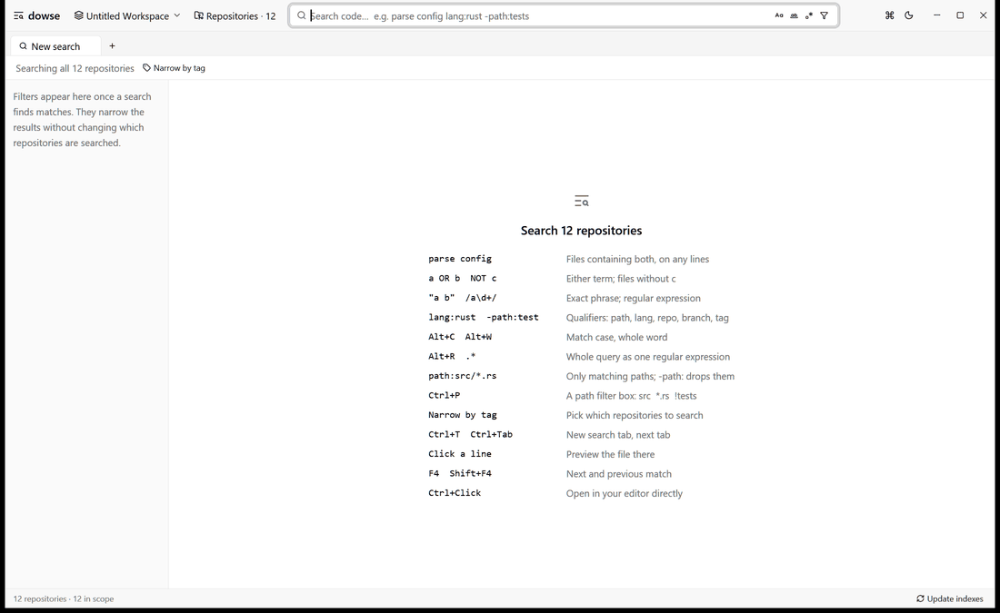

<p align="right">
  <a href="README.md">English</a> | <strong>简体中文</strong>
</p>

<h1>
  <picture>
    <source media="(prefers-color-scheme: dark)" srcset="docs/brand/dowse-wordmark-dark.svg">
    
  </picture>
</h1>

面向本地多代码仓库的高性能代码搜索工具。支持桌面应用与命令行两种交互形态，拥有类似 [grep.app](https://grep.app) 和 GitHub 代码搜索的极速体验，但完全基于你本地磁盘上的代码副本运行——无论是常驻在 `main` 分支的团队镜像仓库，还是正在活跃开发的多个工作副本。底层以 [tgrep](https://github.com/microsoft/tgrep) 的 Trigram（三元语法）索引为核心检索引掣，并通过 [GPUI](https://github.com/zed-industries/zed)（基于 [GPUI Kit](https://gpui-kit.com)）提供 GPU 加速的高响应度界面。



12 个公开开源仓库、45,629 个文件：边键入边返回结果，点击 Facet 秒级收窄至 Rust 语言，表格模式下每行一条匹配，井井有条。

## 核心特性

- **多仓库集中检索，一个输入框搞定。** 支持添加单个仓库或包含多个仓库的父文件夹。类似 VS Code 的工作区（Workspace）机制按窗口分组，结合 `mirror`、`owner:alice` 或 `branch:main` 等标签自由划定搜索范围。[详见桌面应用指南](docs/zh-CN/app.md)
- **实时 GitHub 代码搜索语法。** 边输入边查询：支持 `parse config lang:rust -path:tests`、精确短语、正则表达式、布尔逻辑（`AND`、`OR`、`NOT`），以及按仓库、分支、标签、语言和目录的细粒度 Facet 筛选收窄。[详见搜索语法指南](docs/zh-CN/search.md)
- **代码片段与结构化表格双重视图。** 正则捕获组自动转换为独立表格列，一键导出为 CSV、TSV、Markdown 或 JSON。侧边实时预览窗格无需等待外部编辑器，直接渲染完整文件。[详见结果展示](docs/zh-CN/app.md#结果展示)
- **自动同步保持常新的镜像仓库。** 通过 GitHub CLI（`gh`）批量克隆指定组织或作者的全部仓库，支持后台定时拉取，仅在安全且处于主分支时快进合并（Fast-forward），绝不破坏本地未提交修改。[详见克隆与同步](docs/zh-CN/app.md#从-github-克隆仓库)
- **永不落后的 Trigram 索引。** 索引格式与 `tgrep` 命令行无缝兼容；增量更新仅重编改动文件，并配合后台文件监听器（File Watcher），让每次本地保存立刻可被检索。[详见索引机制](docs/zh-CN/indexes.md)
- **为开发者与 AI Coding Agent 双重设计。** `dowse search` 命令行与运行中的桌面应用共享热索引与长连接 IPC。命令行输出严格控制 Token 预算，主动在错误流推荐缩小范围的 Facet 限定符，并提供专门的 Agent 集成指南（`dowse guide`）。[详见命令行参考](docs/zh-CN/cli.md) 与 [Agent 使用指南](docs/zh-CN/agent-guide.md)
- **内置安全自动更新。** 每天自动检测 GitHub Release，校验官方 SHA-256 签名并无缝就地替换升级。[详见安装指南](docs/zh-CN/install.md#自动与手动更新)

## 快速上手

### 桌面应用

1. **启动并添加仓库**：启动 `dowse`，按快捷键 `Ctrl+O`（macOS 为 `Cmd+O`），或直接将文件夹拖拽到窗口中。
2. **实时搜索**：输入诸如 `parse config lang:rust -path:tests` 的查询。点击任意匹配行可在右侧即时预览；按 `Alt+T`（macOS 为 `Cmd+Alt+T`）切换为结构化表格视图。
3. **管理与打标**：打开仓库管理页面（`Ctrl+,`），为仓库添加自定义标签，在结果上方范围栏中一键勾选要搜索的仓库子集。

### 命令行

```bash
# 在已注册的所有仓库中检索
dowse search 'parse_config lang:rust'

# 仅检索当前终端工作目录所在的仓库
dowse search --here 'parse_config'

# 查看所有已索引仓库及其分支、文件统计
dowse repos

# 输出面向 AI Coding Agent 的使用指南
dowse guide
```

在应用内随时按下 `Ctrl+K`（macOS 为 `Cmd+K`）即可唤起命令面板（Command Palette），查看全部功能及其对应快捷键。

## 安装与下载

前往 [GitHub Latest Release](https://github.com/HenryZhang-ZHY/dowse/releases/latest) 下载对应平台的预编译安装包：

| 平台                                  | 压缩包                                | 说明                                                                                                                            |
| ------------------------------------- | ------------------------------------- | ------------------------------------------------------------------------------------------------------------------------------- |
| **Windows (x64)**                     | `dowse-<version>-windows-x86_64.zip`  | 包含 `dowse.exe`（GUI 主程序）与 `dowse.com`（CLI 控制台入口）。解压到某个文件夹并加入环境变量 `PATH`。                         |
| **macOS 11+** (Apple Silicon / Intel) | `dowse-<version>-macos-universal.zip` | 通用架构 `dowse.app`。解压后拖入 `/Applications`。终端使用可将 `/Applications/dowse.app/Contents/MacOS/dowse` 软链接至 `PATH`。 |
| **Linux** (x64 / arm64)               | `dowse-<version>-linux-<arch>.tar.gz` | 单二进制文件，兼具 GUI 与 CLI 功能。需要 glibc 2.35+（Ubuntu 22.04+、Debian 12+、Fedora 36+）及 Vulkan 图形驱动支持。           |

开源发布包未购买昂贵的商业代码签名证书，初次运行可能出现系统安全提示。更多平台安全提示绕过方法、路径配置及从源码编译步骤，请参见 [安装与更新指南](docs/zh-CN/install.md)。

## 文档导航

完整文档可在 [文档中心（Documentation Hub）](docs/zh-CN/README.md) 中查阅：

| 文档                                               | 内容说明                                                |
| -------------------------------------------------- | ------------------------------------------------------- |
| [文档中心](docs/zh-CN/README.md)                   | 全局文档目录索引、学习路线与高频快捷键速查              |
| [安装与更新](docs/zh-CN/install.md)                | 运行环境要求、下载安装、后台自动更新与源码编译指南      |
| [桌面应用](docs/zh-CN/app.md)                      | 工作区概念、仓库管理、多标签页、表格导出与快捷键        |
| [搜索语法](docs/zh-CN/search.md)                   | GitHub 兼容语法规则、路径漏斗过滤器与内部执行流水线     |
| [索引机制](docs/zh-CN/indexes.md)                  | Trigram 索引原理、索引存放位置与增量更新机制            |
| [命令行工具](docs/zh-CN/cli.md)                    | 全部 CLI 子命令详解、JSON/表格结构化输出与 IPC 架构     |
| [AI Agent 编码助手指南](docs/zh-CN/agent-guide.md) | 面向大模型编码助手的最佳实践与设计哲学（`dowse guide`） |
| [架构与开发](docs/zh-CN/development.md)            | 项目源码结构、模块划分、单元测试与发布流程              |

## 开源协议

本项目采用 [MIT 许可证](LICENSE)。
