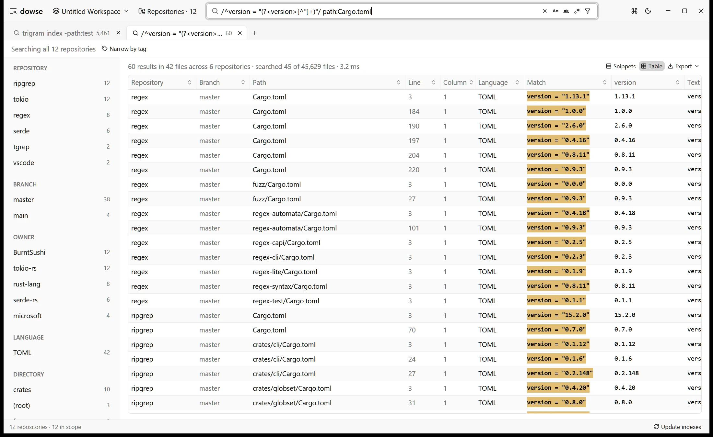

<p align="right">
  <a href="../app.md">English</a> | <strong>简体中文</strong>
</p>

# 桌面应用程序指南

dowse 拥有一款基于 [GPUI](https://github.com/zed-industries/zed)（通过 [GPUI Kit](https://gpui-kit.com)）构建的高性能硬件加速桌面应用。它将跨多仓库代码检索、毫秒级实时查询求值、全文件即时语法高亮预览和 Git 镜像自动化拉取整合于一个高度响应、全键盘友好的图形界面中。

- [工作区与窗口](#工作区与窗口)
- [添加仓库](#添加仓库)
- [仓库管理页面](#仓库管理页面)
- [从 GitHub 克隆仓库](#从-github-克隆仓库)
- [后台任务与定时同步](#后台任务与定时同步)
- [标签与检索范围](#标签与检索范围)
- [结果展示：代码片段与表格视图](#结果展示代码片段与表格视图)
- [多标签页与导航历史](#多标签页与导航历史)
- [全文件预览与外部编辑器](#全文件预览与外部编辑器)
- [菜单栏、命令面板与快捷键](#菜单栏命令面板与快捷键)
- [开发者工具](#开发者工具)

关于搜索语法细节，请参阅 [搜索语法详解](search.md)；关于底层 Trigram 索引的构建与维护，请参阅 [Trigram 索引深度解析](indexes.md)。

---

## 工作区与窗口

每个桌面窗口对应一个独立的工作区（Workspace），即该窗口所纳入检索的代码仓库集合，类似于 VS Code 的多根工作区。

- **未命名与已保存工作区**：新建窗口默认处于未命名状态。你可以将其另存为 `.dowse-workspace` 文件以便随时重新打开或与他人共享；后续对仓库的增删操作会自动持久化写回该文件。
- **会话自动恢复**：重新启动 dowse 时，上一次退出时的所有窗口（包括未命名的临时工作区）都会原样完整恢复。
- **跨窗口共享资源**：当多个窗口包含同一个代码仓库时，它们会自动复用该仓库在内存中的 Trigram 索引与文件系统监听器（File Watcher），绝不产生重复的内存开销或重复索引计算。
- **工作区菜单**：点击菜单栏的 **Workspace** 项可新建、打开、保存或切换工作区。最近打开的工作区会在此列出，点击条目右侧的 `×` 可将其从历史记录移除（不会删除物理磁盘上的文件）。当前窗口绑定的工作区名称会实时显示在状态栏左侧。

### 终端启动方式

通过终端启动 dowse 的参数风格与 VS Code 的 `code` 命令高度一致：

| 命令                           | 行为说明                                                                                                |
| ------------------------------ | ------------------------------------------------------------------------------------------------------- |
| `dowse`                        | 恢复上一次会话打开的全部窗口。                                                                          |
| `dowse <folder>...`            | 将指定的文件夹作为新的未命名工作区打开。若指定的是包含多个 Git 仓库的父目录，会自动注册其下全部子仓库。 |
| `dowse <file>.dowse-workspace` | 打开指定的工作区文件；若已有窗口处于打开状态则直接激活并聚焦该窗口。                                    |
| `dowse --add <folder>...`      | 将指定文件夹追加到当前处于焦点状态的工作区窗口中。                                                      |
| `dowse --remove <folder>...`   | 从当前工作区窗口中移除指定文件夹。                                                                      |

> [!NOTE]
> dowse 默认保持单实例运行。在应用已启动的情况下再次在终端执行 `dowse`，会将命令行参数通过本地 Socket 发送给后台运行的实例并立刻退出。每个不同的 [配置目录](install.md#配置文件与数据存放位置)（通过 `DOWSE_CONFIG_DIR` 指定）各自维持独立的单实例进程。

---

## 添加仓库

你可以按需逐一添加代码仓库，也可以直接指定包含多个 Git 仓库的父目录：

- **拖拽添加**：直接将一个或多个文件夹从文件管理器拖入应用窗口，或拖入 `.dowse-workspace` 文件以加载工作区。
- **快捷键选取**：按快捷键 `Ctrl+O`（macOS 为 `Cmd+O`）呼出系统文件夹选择器。
- **命令行追加**：在终端执行 `dowse --add <folder>`。
- **Windows 资源管理器集成**：在仓库管理页面的设置区域中，可一键向 Windows 右键菜单写入“添加到 dowse”。此后右键点击任何文件夹即可直接加入检索范围，双击 `.dowse-workspace` 文件可直接唤起打开（该操作仅写入当前用户的注册表键值 `HKEY_CURRENT_USER`）。

每一条搜索结果都会在文件路径旁清晰标明其归属的仓库名称及当前检出的分支。

---

## 仓库管理页面

按下 `Ctrl+,`（macOS 为 `Cmd+,`）或点击菜单栏中的 **Repositories**，即可进入仓库全景管理界面。


该页面的核心功能包括：

- **快速筛选**：按名称、本地路径、分支名或标签对仓库进行实时过滤。
- **批量操作**：勾选单行复选框（或点击表头复选框全选当前筛选出的所有仓库），在表头一键执行批量操作：
  - 批量拉取最新代码（`git pull`）
  - 更新或全量重建 Trigram 索引
  - 批量添加或移除标签（输入 `-tag` 表示从选中项中移除该标签）
  - 批量配置自动拉取同步周期
  - 迁移索引存储位置（在仓库内部 `.tgrep` 与外部集中目录之间切换）
  - 从当前工作区中移除
- **详情查看**：展开单行即可查看该仓库的打标详情、定时拉取设置、索引大小、文件计数及上一次拉取的结果与诊断信息。
- **全局偏好设置**：配置全局默认的索引存储策略及系统 Shell 上下文菜单。
- **一键返回**：按 `Alt+Left`（或点击返回箭头）无缝回到之前的搜索视图。

---

## 从 GitHub 克隆仓库

仓库管理页面的 GitHub 区域内置了基于 [GitHub CLI](https://cli.github.com)（`gh`）的批量克隆面板。

- **免凭证交互**：dowse 完全复用宿主机中 `gh` 的登录态（只需事先执行过一次 `gh auth login`），dowse 本身不接触、不存储任何个人 Token 或密码。
- **并发快速分页**：支持任意个人账号或组织的仓库列表查询，后台多线程并发抓取分页，即便是拥有 2000+ 仓库的企业级组织也能在数秒内加载完毕。
- **列表筛选**：可按仓库名称检索，支持按 Fork 状态、归档（Archive）状态快速过滤。
- **三种克隆模式**：
  - **无 Blob 克隆（Blobless，默认且强烈推荐）**：克隆完整的提交历史与元数据，但在检出时按需懒加载具体文件内容。对于大型单体仓库，克隆耗时可从数十分钟缩短至数秒，同时 `git log` 和 `git blame` 等操作完全正常运作。
  - **浅克隆（Shallow）**：仅抓取最近一次提交（`--depth 1`），占用磁盘空间最小。
  - **完整克隆（Full）**：标准的完整 Git 深度克隆。
- **自动归档与打标**：代码会被克隆至 `<目标目录>/<所有者>/<仓库名>`，并自动打上 `owner:<所有者>` 标签。克隆完成后自动加入工作区并派发至后台开始建立索引。
- **已克隆状态感知**：本地已存在的仓库会以徽标明确标识，支持一键直接添加到工作区。

---

## 后台任务与定时同步

克隆与拉取等耗时 I/O 操作均在独立的后台工作线程池中执行，界面交互完全不受阻塞：

- **并发度限制**：默认同时最多执行 4 个克隆与 4 个拉取任务。你可以在界面任务面板中调整，也可以通过命令行动态设定：
  ```bash
  dowse settings set tasks.clones 8
  dowse settings set tasks.pulls 8
  ```
- **任务管理面板**：页面中的 Tasks 区域可查看实时下载进度、吞吐与错误日志，并支持对单个任务取消（`dowse tasks cancel <id>`）、重试或批量清空。状态栏会实时显示后台运行的任务总数。
- **后台守护执行**：即使你关闭了全部桌面窗口，dowse 仍会在系统后台静默守护，直到全部克隆或拉取任务安全结束。
- **安全的自动化拉取**：为仓库指定同步周期（如 `15m`、`1h`、`3d` 等）。只要 dowse 处于运行状态且距离上次拉取超过设定周期，就会自动触发同步：
  - 执行 `git fetch origin` 获取远端最新引用。
  - **仅在安全时快进合并（Fast-forward）**：要求本地检出的正是远端默认追踪分支、工作区无任何未暂存改动且无未推送的本地提交。
  - 若检测到非安全状态（例如处在开发分支 `feature/x` 或存在未提交修改），系统仅完成 fetch 并记录跳过原因，绝不私自触发 merge、rebase 或 stash。
  - 成功拉取新提交后，自动调度增量索引更新。
  - 已设置同步的仓库会自动获得 `sync:<周期>` 标签，方便在检索范围栏中一键圈定。

---

## 标签与检索范围

标签用于灵活地对仓库归类并界定检索边界：

- **标签命名格式**：支持常规独立标签（如 `mirror`、`dev`、`core`）以及键值对形式（如 `owner:alice`、`project:billing`）。
- **动态分支标签**：所有仓库都会根据本地当前检出的分支自动打上 `branch:<分支名>` 标签，并在分支切换时自动刷新。
- **范围栏（Scope Bar）**：位于搜索结果上方，点击标签即可动态组合要搜索的仓库范围：
  - 同组标签（如 `owner:alice` 与 `owner:bob`）之间为 **OR**（并集）逻辑。
  - 跨组标签（如 `dev` 与 `owner:alice`）之间为 **AND**（交集）逻辑。
- **Facet 侧边栏**：左侧工具栏（快捷键 `Ctrl+B`）展示当前查询在仓库、分支、标签组、编程语言及一级目录维度的命中统计：
  - 命中数字完全基于当前其他筛选条件计算得出，体验与 [grep.app](https://grep.app) 保持一致。
  - 点击任意 Facet 项可在不改动全局工作区配置的前提下瞬间收窄匹配结果。


---

## 结果展示：代码片段与表格视图

dowse 提供代码片段与结构化表格两种展示模式：

### 1. 代码片段视图（默认）

- 基于 Tree-sitter 语法分析器呈现精准的语法高亮，匹配行附带上下文。
- 查询关键词与正则命中区域以鲜明主题色着色。
- 单文件中命中过多时会自动折叠并提示（“展开其余 N 处匹配”）。

### 2. 表格视图（`Alt+T` / macOS 为 `Cmd+Alt+T`）

- 将命中数据整齐平铺为结构化表格：每行对应一处匹配，包含 `Repository`（仓库）、`Branch`（分支）、`Path`（路径）、`Line`（行号）、`Column`（列号）、`Language`（语言）、`Match`（命中片段）与 `Line Text`（整行内容）。
- **正则捕获组自动转列**：当搜索模式包含命名捕获组时，每个捕获组会自动解析为独立的排序列：
  ```
  /version = "(?<version>[^"]+)"/ path:Cargo.toml
  ```
  只需一条正则，即可把分散在各仓库中的版本号、接口路由、依赖声明一键提取为结构化数据集。
- **列排序与列宽调整**：点击表头即可排序（数值类型按数字大小排列），拖拽表头边缘可自由调整列宽。
- **数据导出**：按快捷键 `Ctrl+Shift+E`（macOS 为 `Cmd+Shift+E`）或点击 **Export** 按钮，可将当前可见行导出为 **CSV**（带 UTF-8 BOM，Excel 双击即开且无乱码）、**TSV**、**Markdown** 表格或 **JSON**。支持直接复制为 TSV 或 Markdown 粘贴至电子表格或 Issue。



---

## 多标签页与导航历史

- **多标签并发检索**：
  - `Ctrl+T`（macOS 为 `Cmd+T`）：新建搜索标签页。
  - `Ctrl+W`（macOS 为 `Cmd+W`）：关闭当前标签页（亦可用鼠标中键点击标签）。
  - `Ctrl+Tab` / `Ctrl+Shift+Tab`：在打开的标签页之间快速切换。
  - 每个标签页独立保留其查询语句、模式开关、路径过滤器以及预览滚动进度。
- **浏览器级历史前进与后退**：
  - 使用标题栏箭头、快捷键 `Alt+Left` / `Alt+Right`（macOS 为 `Ctrl+-` / `Ctrl+Shift+-`）或鼠标侧键即可在检索历史之间穿梭。
  - 后退会精准复原之前的检索词、激活的过滤条件、选中的预览文件及当时的滚动位移。
  - 只有在输入暂停、按回车、修改过滤选项或点击结果时才会记录历史步进，避免单个字符打字产生过多历史碎片。

---

## 全文件预览与外部编辑器

在搜索结果中单击任意匹配项，即可在右侧展开即时全文件预览面板：


- **0 延迟原生渲染**：文件由内置 GPUI 文本引擎瞬时加载并高亮渲染，无需等待任何外部编辑器启动。
- **匹配项精准跳转**：使用 `F4` 与 `Shift+F4`（或工具栏上下箭头）可以在文件中的所有匹配点之间顺次跳转，光标会直接落于命中单词首字母。
- **分栏拖拽与收起**：拖动分栏线即可调整宽度；按 `Esc` 或 `Ctrl+Alt+B`（macOS 为 `Cmd+Alt+B`）可收起预览面板。
- **只读文本选择**：支持鼠标划选、双击选词、三击选行，按 `Ctrl+C`（macOS 为 `Cmd+C`）复制。长行会自动软折行以适应屏幕，不改变文件原始内容。
- **唤起外部编辑器**：点击预览面板顶部的 **Open in Editor** 按钮，或在搜索结果列表中按住 `Ctrl` 点击，可直接跳转至外部编辑器并精确定位到对应的行和列。
  - 自动探测环境变量 `PATH` 中的 VS Code、Cursor、Zed 或 Sublime Text。
  - 也可通过环境变量 `DOWSE_EDITOR` 进行自定义，例如：
    ```bash
    export DOWSE_EDITOR="code -g {file}:{line}"
    export DOWSE_EDITOR="nvim-qt +{line} {file}"
    ```

---

## 菜单栏、命令面板与快捷键

按下 `Ctrl+K`（macOS 为 `Cmd+K`，或 `Ctrl+Shift+P`）即可唤起全局**命令面板（Command Palette）**：

- 支持模糊搜索所有命令、打开的标签页、当前范围标签、最近工作区以及各类查询限定符。
- 输入首字母缩写（例如 `nt` 匹配 New Tab）并按回车即可立即执行。
- 可在标题栏菜单（`⋮`）中随时切换明亮（Light）与暗黑（Dark）主题。

### 核心快捷键一览

| 快捷键 (Win / Linux)            | 快捷键 (macOS)        | 说明                             |
| ------------------------------- | --------------------- | -------------------------------- |
| `Ctrl+O`                        | `Cmd+O`               | 添加仓库或包含仓库的父文件夹     |
| `Ctrl+,`                        | `Cmd+,`               | 打开仓库管理页面                 |
| `Ctrl+F`                        | `Cmd+F`               | 聚焦主搜索输入框                 |
| `Ctrl+P`                        | `Cmd+P`               | 开启/关闭路径漏斗过滤器          |
| `Alt+T`                         | `Cmd+Alt+T`           | 切换代码片段与表格视图           |
| `Alt+C`                         | `Cmd+Alt+C`           | 切换区分大小写匹配               |
| `Alt+W`                         | `Cmd+Alt+W`           | 切换全字匹配                     |
| `Alt+R`                         | `Cmd+Alt+R`           | 切换整句正则表达式模式           |
| `Ctrl+B`                        | `Cmd+B`               | 显示/隐藏 Facets 侧边栏          |
| `Ctrl+Alt+B`                    | `Cmd+Alt+B`           | 显示/隐藏右侧文件预览面板        |
| `Ctrl+T` / `Ctrl+W`             | `Cmd+T` / `Cmd+W`     | 新建 / 关闭搜索标签页            |
| `Ctrl+Shift+N`                  | `Cmd+Shift+N`         | 新建工作区窗口                   |
| `Ctrl+Shift+O` / `Ctrl+Shift+S` | `Cmd+Shift+O / S`     | 打开 / 保存工作区文件            |
| `Ctrl+Shift+E`                  | `Cmd+Shift+E`         | 将表格视图数据导出为 CSV 文件    |
| `Ctrl+Shift+R`                  | `Cmd+Shift+R`         | 增量更新当前范围内的全部仓库索引 |
| `F4` / `Shift+F4`               | `F4` / `Shift+F4`     | 跳至下一个 / 上一个命中点        |
| `Ctrl+Shift+I` / `F12`          | `Cmd+Shift+I` / `F12` | 打开开发者工具诊断窗口           |

---

## 开发者工具

按下 `Ctrl+Shift+I`（macOS 为 `Cmd+Shift+I`）或 `F12` 可呼出内置的开发者诊断套件：

- **实时日志流**：以毫秒级时间戳流式展示应用运行日志，支持按级别（`debug`、`info`、`warn`、`error`）或正则过滤。
- **引擎指标监控**：查看内存占用、单次搜索耗时、候选文件裁剪节省的磁盘读取量、索引构建/增量更新耗时分布。
- **查询诊断分析**：列出最近触发的历次搜索，清晰展示每个查询命中的候选集规模与验证耗时。
- **一键诊断复制**：点击 Copy Diagnostics 可将完整的系统环境与性能指标复制至剪贴板，便于提报 Issue。
- **CLI 终端对照**：上述指标亦可在终端中通过对应子命令查看：
  ```bash
  dowse dev logs -f
  dowse dev metrics
  dowse status
  ```
